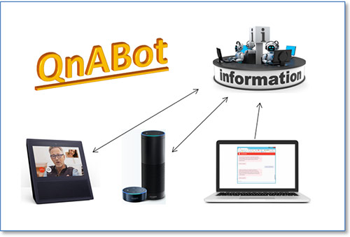

# Chatbot para perguntas e respostas

### [Repositório da Demo](https://github.com/aws-samples/aws-ai-qna-bot)

 

 

## Visão geral

Nesta demo você econtra o código descrito no Blog Post [Criando um Chatbot de perguntas e respostas utilizando Amazon Lex e Amazon Alexa](https://aws.amazon.com/blogs/machine-learning/creating-a-question-and-answer-bot-with-amazon-lex-and-amazon-alexa/) 

## Realizando Deploy de um ChatBot utilizando Cloud Formation

Tutorial sobre como utilizar Infraestrutura como realizar o Deploy de um ChatBot utilizando Cloud Formation - https://www.youtube.com/watch?v=O9Sq9plyTxY&feature=youtu.be