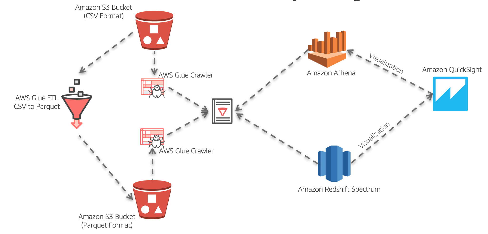

# serverless-data-analytics

### [Repositório da Demo](https://github.com/aws-samples/serverless-data-analytics)

 

 

## Visão geral

Neste laboratório, você criará uma arquitetura serverless para analisar os dados diretamente do Amazon S3 usando o Amazon Athena e visualizar os dados no Amazon QuickSight. O conjunto de dados que você usará é um conjunto de dados públicos que inclui registros de todas as viagens concluídas nos táxis amarelo e verde em Nova York de 2009 a 2016 e todas as viagens em veículos de aluguel (FHV) de 2015 a 2016. Os registros incluem campos que capturam datas e horários de embarque e desembarque, locais de embarque e desembarque, distâncias de viagem, tarifas especificadas, tipos de tarifa, tipos de pagamento e contagem de passageiros informados pelo motorista. O conjunto de dados já está particionado e convertido de CSV para Apache Parquet. Na primeira parte do laboratório, você criará consultas como SQL usando o Amazon Athena. Você consultará os dois formatos de dados diretamente do Amazon S3 e comparará o desempenho da consulta. Na segunda parte do laboratório, você usará o Amazon QuickSight para gerar visualizações e informações significativas do conjunto de dados no Amazon S3 usando as tabelas Athena criadas durante a primeira parte do laboratório. Um laboratório opcional está incluído para incorporar ETL serverless usando o AWS Glue para otimizar o desempenho da consulta. Também oferecemos acesso a um laboratório de uso doméstico, para que você aplique novamente o mesmo design e consulte diretamente o mesmo conjunto de dados no Amazon S3 em um data warehouse do Amazon Redshift usando o Redshift Spectrum.

